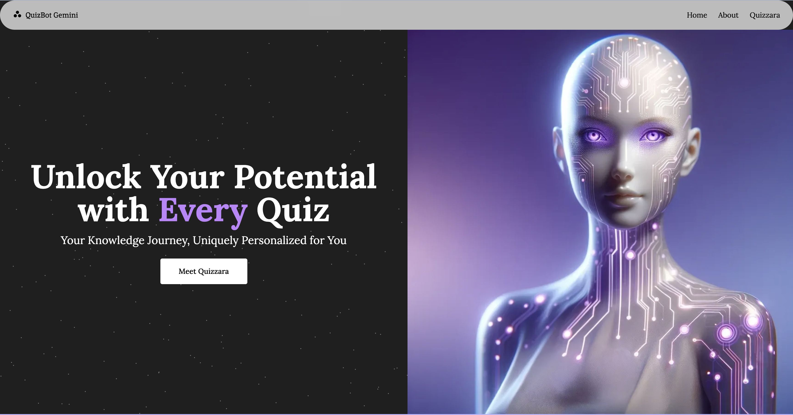

# QuizBot Gemini
A chatbot that uses Gemini capabilities to quiz users and test their knowledge on their chosen topic by asking related questions.

## Preview
<div align="center">
    <a href="https://www.quizbotgemini.com/">
        
    </a>
</div>

## Getting Started ✨

### Clone project
```bash
$ git clone https://github.com/rukaiah-edhah/QuizBotGemini.git 
```

### Install dependencies 
```bash
$ npm i

or

$ npm install
```

### Run in Development
```bash
$ npm run dev
```